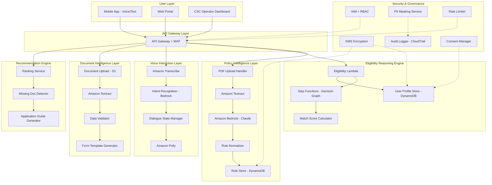

# Design Document: JanMitra AI Platform

## Overview

The JanMitra AI Platform is a cloud-native, AI-powered system designed to democratize access to 1000+ government welfare schemes for rural India. The platform leverages AWS services to provide intelligent policy ingestion, eligibility reasoning, multilingual voice interaction, and document intelligence capabilities.

### Core Design Principles

1. **Voice-First**: Prioritize voice interaction for low-literacy users
2. **Intelligent Automation**: Use AI/ML to minimize manual data entry
3. **Scalable Architecture**: Support 100M+ users with elastic scaling
4. **Security by Design**: Encrypt PII, enforce RBAC, maintain audit trails
5. **Offline-First Mobile**: Enable basic functionality without connectivity
6. **Interpretable AI**: Provide explainable recommendations and eligibility decisions

### Technology Stack

- **Cloud Provider**: AWS (leveraging AWS Activate credits)
- **Compute**: AWS Lambda (serverless), ECS Fargate (containerized services)
- **Storage**: S3 (documents), DynamoDB (user profiles, schemes), RDS Aurora (transactional data)
- **AI/ML**: Amazon Bedrock (LLM), Amazon Textract (OCR), Amazon Transcribe (STT), Amazon Polly (TTS)
- **Integration**: Step Functions (orchestration), EventBridge (event routing), SQS (async processing)
- **Security**: IAM, KMS, Secrets Manager, WAF, GuardDuty
- **Monitoring**: CloudWatch, X-Ray, CloudTrail

## Architecture


### High-Level Architecture Diagram



### Layer Descriptions

**1. Policy Intelligence Layer**
- Ingests PDF policy documents via S3 upload
- Extracts text using Amazon Textract (OCR)
- Uses Amazon Bedrock (Claude) to identify eligibility rules from unstructured text
- Normalizes rules into standardized JSON schema
- Stores versioned rules in DynamoDB with indexing for fast retrieval

**2. Eligibility Reasoning Engine**
- Receives user profile and evaluates against all active scheme rules
- Uses AWS Step Functions to traverse complex decision graphs
- Implements constraint-based filtering to eliminate non-matching schemes
- Computes match scores (0-100) based on profile completeness and rule satisfaction
- Returns ranked list of eligible schemes with confidence scores

**3. Voice Interaction Layer**
- Amazon Transcribe converts speech to text in 10 Indian languages
- Intent recognition using Bedrock identifies user goals (check eligibility, ask question, etc.)
- Dialogue State Manager maintains conversation context across turns
- Amazon Polly generates natural speech responses in user's language
- Supports code-switching and regional accents

**4. Document Intelligence Layer**
- Users upload document photos to S3
- Amazon Textract extracts structured data (Aadhaar, income certificates, etc.)
- Data Validator cross-checks extracted fields for consistency
- Auto-populates user profile with validated data
- Generates pre-filled application forms

**5. Recommendation Engine**
- Ranks schemes by match score, benefit amount, and approval probability
- Detects missing documents required for each scheme
- Generates step-by-step application guidance in user's language
- Prioritizes schemes with approaching deadlines

**6. Security & Governance**
- IAM enforces role-based access control (user, CSC operator, admin)
- KMS encrypts PII at rest in DynamoDB and S3
- PII Masking Service redacts sensitive data in logs
- CloudTrail maintains immutable audit logs
- Rate Limiter prevents abuse (100 req/min per user)
- Consent Manager tracks user permissions with timestamps

## Components and Interfaces


### 1. Policy Ingestion Service

**Responsibility**: Convert PDF policy documents into structured, queryable rule schemas.

**Interface**:
```typescript
interface PolicyIngestionService {
  uploadPolicyDocument(file: File, metadata: SchemeMetadata): Promise<UploadResult>
  extractRules(documentId: string): Promise<RuleExtractionResult>
  validateRuleSchema(rules: RuleSchema): ValidationResult
  storeRules(rules: RuleSchema, version: string): Promise<string>
}

interface SchemeMetadata {
  schemeName: string
  department: string
  state?: string
  effectiveDate: Date
  expiryDate?: Date
}

interface RuleSchema {
  schemeId: string
  eligibilityCriteria: Condition[]
  benefits: Benefit[]
  requiredDocuments: string[]
  applicationProcess: Step[]
}

interface Condition {
  field: string  // e.g., "age", "income", "caste"
  operator: "eq" | "gt" | "lt" | "gte" | "lte" | "in" | "between"
  value: any
  logicalOperator?: "AND" | "OR" | "NOT"
  nestedConditions?: Condition[]
}
```

**Implementation**:
- Lambda function triggered by S3 upload event
- Textract extracts text with table detection
- Bedrock (Claude) prompt: "Extract eligibility criteria from this scheme document. Return structured JSON with conditions, benefits, and required documents."
- Rule Normalizer validates schema completeness
- DynamoDB stores rules with GSI on state, department, and scheme type

### 2. Eligibility Engine

**Responsibility**: Evaluate user profiles against scheme rules and compute match scores.

**Interface**:
```typescript
interface EligibilityEngine {
  checkEligibility(userId: string, schemeIds?: string[]): Promise<EligibilityResult[]>
  computeMatchScore(profile: UserProfile, rule: RuleSchema): number
  explainEligibility(userId: string, schemeId: string): Promise<Explanation>
}

interface UserProfile {
  userId: string
  demographics: {
    age: number
    gender: string
    caste: string
    occupation: string
  }
  financial: {
    annualIncome: number
    landOwnership: number  // in acres
    bankAccount: boolean
  }
  location: {
    state: string
    district: string
    pincode: string
  }
  documents: {
    aadhaar: boolean
    incomeCertificate: boolean
    casteCertificate: boolean
    bankPassbook: boolean
  }
}

interface EligibilityResult {
  schemeId: string
  schemeName: string
  eligible: boolean
  matchScore: number  // 0-100
  missingDocuments: string[]
  missingProfileFields: string[]
  explanation: string
}
```

**Implementation**:
- Lambda function with 3GB memory, 30s timeout
- Step Functions orchestrates complex decision graphs
- Constraint-based filtering: eliminate schemes where hard constraints fail
- Match score formula: `(satisfied_conditions / total_conditions) * 100 * benefit_weight`
- DynamoDB query with GSI on state and scheme type for fast filtering
- Cache frequently accessed rules in ElastiCache (Redis)

### 3. Voice Interface Service

**Responsibility**: Enable multilingual voice interaction with speech-to-text and text-to-speech.

**Interface**:
```typescript
interface VoiceInterfaceService {
  transcribeSpeech(audioFile: Buffer, language: string): Promise<string>
  recognizeIntent(text: string, context: DialogueContext): Promise<Intent>
  manageDialogue(intent: Intent, context: DialogueContext): Promise<DialogueResponse>
  synthesizeSpeech(text: string, language: string): Promise<Buffer>
}

interface DialogueContext {
  sessionId: string
  userId?: string
  conversationHistory: Turn[]
  currentState: string
  extractedEntities: Record<string, any>
}

interface Intent {
  name: string  // "check_eligibility", "ask_question", "provide_info", "apply_scheme"
  confidence: number
  entities: Record<string, any>
}

interface DialogueResponse {
  text: string
  audio: Buffer
  nextState: string
  clarificationNeeded: boolean
  actions: Action[]
}
```

**Implementation**:
- Amazon Transcribe with custom vocabulary for scheme names and Indian terms
- Intent recognition using Bedrock with few-shot prompting
- Dialogue State Manager tracks conversation flow (greeting → profile_collection → eligibility_check → recommendation → application)
- Amazon Polly with neural voices for natural prosody
- DynamoDB stores session state with TTL of 1 hour

### 4. Document Intelligence Service

**Responsibility**: Extract structured data from uploaded identity and income documents.

**Interface**:
```typescript
interface DocumentIntelligenceService {
  uploadDocument(file: File, documentType: string, userId: string): Promise<string>
  extractData(documentId: string): Promise<ExtractedData>
  validateData(data: ExtractedData): Promise<ValidationResult>
  autoFillProfile(userId: string, data: ExtractedData): Promise<void>
}

interface ExtractedData {
  documentType: string
  fields: Record<string, FieldValue>
  confidence: Record<string, number>
  rawText: string
}

interface FieldValue {
  value: any
  confidence: number
  boundingBox?: BoundingBox
}

interface ValidationResult {
  valid: boolean
  errors: ValidationError[]
  warnings: string[]
  crossValidation: CrossValidationResult[]
}
```

**Implementation**:
- S3 stores uploaded documents with server-side encryption (SSE-KMS)
- Textract AnalyzeDocument API with FORMS and TABLES analysis
- Custom field extraction logic for Aadhaar (regex for 12-digit number), income certificates (amount parsing)
- Cross-validation: check if name on Aadhaar matches name on income certificate
- Auto-fill profile by merging extracted data with existing profile
- Flag low-confidence fields (<80%) for manual review

### 5. Recommendation Engine

**Responsibility**: Rank schemes and provide actionable guidance for applications.

**Interface**:
```typescript
interface RecommendationEngine {
  rankSchemes(eligibilityResults: EligibilityResult[]): Promise<RankedScheme[]>
  detectMissingDocuments(userId: string, schemeId: string): Promise<string[]>
  generateApplicationGuide(schemeId: string, language: string): Promise<ApplicationGuide>
}

interface RankedScheme {
  schemeId: string
  schemeName: string
  matchScore: number
  benefitAmount: number
  applicationComplexity: "low" | "medium" | "high"
  approvalProbability: number
  deadline?: Date
  urgency: "low" | "medium" | "high"
  missingDocuments: string[]
}

interface ApplicationGuide {
  steps: Step[]
  estimatedTime: string
  requiredDocuments: DocumentRequirement[]
  helplineNumber: string
  faqUrl: string
}

interface Step {
  stepNumber: number
  description: string
  actionType: "fill_form" | "upload_document" | "visit_office" | "wait_approval"
  estimatedDuration: string
}
```

**Implementation**:
- Ranking algorithm: `rank_score = match_score * 0.4 + benefit_weight * 0.3 + approval_probability * 0.2 + urgency_weight * 0.1`
- Benefit weight: normalize benefit amounts to 0-100 scale
- Approval probability: historical data from scheme analytics
- Urgency weight: schemes with deadlines <30 days get higher weight
- Application guide generated using Bedrock with scheme-specific templates

## Data Models


### DynamoDB Tables

**1. UserProfiles Table**
```typescript
{
  PK: "USER#<userId>",
  SK: "PROFILE",
  userId: string,
  aadhaarHash: string,  // SHA-256 hash for deduplication
  mobileNumber: string,  // encrypted
  demographics: {
    name: string,  // encrypted
    age: number,
    gender: string,
    caste: string,
    occupation: string
  },
  financial: {
    annualIncome: number,
    landOwnership: number,
    bankAccount: boolean
  },
  location: {
    state: string,
    district: string,
    pincode: string
  },
  documents: {
    aadhaar: { uploaded: boolean, s3Key?: string, verified: boolean },
    incomeCertificate: { uploaded: boolean, s3Key?: string, verified: boolean },
    casteCertificate: { uploaded: boolean, s3Key?: string, verified: boolean }
  },
  preferences: {
    language: string,
    notificationChannels: string[]
  },
  createdAt: string,
  updatedAt: string,
  lastLoginAt: string
}

// GSI: StateDistrictIndex (state, district) for geographic queries
// GSI: CasteIncomeIndex (caste, annualIncome) for demographic analysis
```

**2. SchemeRules Table**
```typescript
{
  PK: "SCHEME#<schemeId>",
  SK: "VERSION#<version>",
  schemeId: string,
  schemeName: string,
  department: string,
  state: string,
  schemeType: string,  // "subsidy", "loan", "pension", "scholarship"
  eligibilityCriteria: Condition[],
  benefits: {
    type: string,  // "cash", "subsidy", "loan", "service"
    amount?: number,
    description: string
  },
  requiredDocuments: string[],
  applicationProcess: Step[],
  deadline?: string,
  budget: number,
  beneficiariesTarget: number,
  currentBeneficiaries: number,
  status: "active" | "inactive" | "expired",
  createdAt: string,
  updatedAt: string
}

// GSI: StateTypeIndex (state, schemeType) for filtering by geography and type
// GSI: StatusDeadlineIndex (status, deadline) for active schemes with deadlines
```

**3. EligibilityCache Table**
```typescript
{
  PK: "USER#<userId>",
  SK: "ELIGIBILITY#<timestamp>",
  userId: string,
  eligibilityResults: EligibilityResult[],
  computedAt: string,
  ttl: number  // 24 hours
}
```

**4. Applications Table**
```typescript
{
  PK: "USER#<userId>",
  SK: "APPLICATION#<applicationId>",
  applicationId: string,
  userId: string,
  schemeId: string,
  status: "draft" | "submitted" | "under_review" | "approved" | "rejected",
  submittedAt?: string,
  reviewedAt?: string,
  reviewedBy?: string,
  rejectionReason?: string,
  documents: {
    documentType: string,
    s3Key: string,
    uploadedAt: string
  }[],
  createdAt: string,
  updatedAt: string
}

// GSI: SchemeStatusIndex (schemeId, status) for scheme-wise analytics
```

**5. AuditLogs Table**
```typescript
{
  PK: "USER#<userId>",
  SK: "AUDIT#<timestamp>",
  userId: string,
  action: string,  // "profile_created", "document_uploaded", "eligibility_checked", "application_submitted"
  actorId: string,  // userId or operatorId
  actorType: "user" | "csc_operator" | "admin",
  ipAddress: string,
  userAgent: string,
  requestId: string,
  timestamp: string,
  details: Record<string, any>
}

// GSI: ActionTimestampIndex (action, timestamp) for analytics
```

### RDS Aurora (PostgreSQL) - Transactional Data

**Schemes Table** (master data with relational integrity)
```sql
CREATE TABLE schemes (
  scheme_id UUID PRIMARY KEY,
  scheme_name VARCHAR(255) NOT NULL,
  department VARCHAR(100) NOT NULL,
  state VARCHAR(50),
  scheme_type VARCHAR(50),
  benefit_amount DECIMAL(12, 2),
  deadline DATE,
  status VARCHAR(20),
  created_at TIMESTAMP DEFAULT NOW(),
  updated_at TIMESTAMP DEFAULT NOW()
);

CREATE INDEX idx_state_type ON schemes(state, scheme_type);
CREATE INDEX idx_status_deadline ON schemes(status, deadline);
```

**Applications Table** (with foreign key constraints)
```sql
CREATE TABLE applications (
  application_id UUID PRIMARY KEY,
  user_id UUID NOT NULL,
  scheme_id UUID REFERENCES schemes(scheme_id),
  status VARCHAR(20) NOT NULL,
  submitted_at TIMESTAMP,
  reviewed_at TIMESTAMP,
  reviewed_by UUID,
  rejection_reason TEXT,
  created_at TIMESTAMP DEFAULT NOW(),
  updated_at TIMESTAMP DEFAULT NOW()
);

CREATE INDEX idx_user_scheme ON applications(user_id, scheme_id);
CREATE INDEX idx_scheme_status ON applications(scheme_id, status);
```

### S3 Bucket Structure

```
janmitra-documents/
├── policy-pdfs/
│   ├── <schemeId>/<version>.pdf
├── user-documents/
│   ├── <userId>/
│   │   ├── aadhaar/<timestamp>.jpg
│   │   ├── income-certificate/<timestamp>.jpg
│   │   ├── caste-certificate/<timestamp>.jpg
├── application-documents/
│   ├── <applicationId>/<documentType>/<timestamp>.pdf
```

**Encryption**: All buckets use SSE-KMS with customer-managed keys
**Lifecycle**: User documents archived to Glacier after 2 years
**Versioning**: Enabled for audit compliance

## Scalability Model


### Capacity Planning

**Target Scale**:
- 100M registered users
- 10M daily active users (10% DAU)
- 100K concurrent users during peak hours
- 1000 schemes across all states
- 50M applications per year

**Compute Scaling**:
- **Lambda**: Auto-scales to handle concurrent invocations
  - Eligibility Engine: 10K concurrent executions (reserved concurrency)
  - Voice Interface: 5K concurrent executions
  - Document Intelligence: 3K concurrent executions
- **API Gateway**: 10K requests/second with burst capacity of 5K
- **DynamoDB**: On-demand pricing with auto-scaling
  - UserProfiles: 5K WCU, 10K RCU (peak)
  - SchemeRules: 1K WCU, 20K RCU (read-heavy)
  - EligibilityCache: 10K WCU, 20K RCU (high throughput)

**Storage Scaling**:
- **S3**: Unlimited storage, 100TB estimated for 100M users (1MB avg per user)
- **DynamoDB**: 500GB for UserProfiles, 50GB for SchemeRules
- **RDS Aurora**: 1TB with read replicas (1 primary, 2 read replicas)

**Cost Optimization**:
- Use Lambda reserved concurrency for predictable workloads
- Enable DynamoDB auto-scaling with target utilization of 70%
- Use S3 Intelligent-Tiering for automatic cost optimization
- Cache scheme rules in ElastiCache (Redis) to reduce DynamoDB reads by 80%
- Use CloudFront CDN for static assets (mobile app, web portal)

### Performance Targets

| Metric | Target | Measurement |
|--------|--------|-------------|
| API Response Time (p95) | <3 seconds | CloudWatch Metrics |
| Eligibility Check | <2 seconds | X-Ray Tracing |
| Voice Transcription | <1 second | Transcribe Metrics |
| Document Extraction | <5 seconds | Textract Metrics |
| Cache Hit Rate | >95% | ElastiCache Metrics |
| Database Query Time (p95) | <100ms | RDS Performance Insights |
| Uptime | 99.9% | CloudWatch Alarms |

### AWS Credits Justification

**Estimated Monthly Costs** (at 10M DAU):

| Service | Usage | Monthly Cost |
|---------|-------|--------------|
| Lambda | 500M invocations, 3GB avg | $8,000 |
| DynamoDB | 50K WCU, 100K RCU | $15,000 |
| S3 | 100TB storage, 10M requests | $2,500 |
| RDS Aurora | db.r6g.2xlarge (3 instances) | $3,000 |
| Textract | 5M pages/month | $7,500 |
| Transcribe | 10M minutes/month | $12,000 |
| Polly | 10M characters/month | $400 |
| Bedrock (Claude) | 50M tokens/month | $15,000 |
| API Gateway | 100M requests | $350 |
| CloudFront | 50TB data transfer | $4,000 |
| ElastiCache | cache.r6g.large (2 nodes) | $400 |
| **Total** | | **$68,150/month** |

**Annual Cost**: ~$820,000

**AWS Activate Credits**: $100,000 (Portfolio+ tier)
- Covers ~1.5 months of full-scale operation
- Enables MVP development and initial user onboarding (0-1M users)
- Reduces burn rate during pilot phase in 5 states

**Cost Reduction Strategies**:
- Start with 5 pilot states (reduce scheme data by 80%)
- Use Savings Plans for Lambda and RDS (30% discount)
- Optimize Bedrock usage with prompt caching and smaller models
- Implement aggressive caching to reduce API calls by 70%
- Target 1M users in Year 1 (10% of scale, ~$80K/month)

## Error Handling


### Error Categories and Handling Strategies

**1. User Input Errors**
- **Invalid Profile Data**: Return validation errors with specific field names and expected formats
- **Missing Required Fields**: Prompt user to complete profile with clear guidance
- **Document Upload Failures**: Retry with exponential backoff (3 attempts), then prompt user to re-upload
- **Voice Recognition Errors**: Ask clarifying questions, offer text input fallback

**2. System Errors**
- **Lambda Timeout**: Implement circuit breaker pattern, return cached results if available
- **DynamoDB Throttling**: Use exponential backoff with jitter, queue requests in SQS
- **S3 Upload Failures**: Retry with presigned URLs, implement multipart upload for large files
- **Textract Failures**: Fall back to manual data entry, log for admin review

**3. External Service Errors**
- **Bedrock API Errors**: Implement retry logic with exponential backoff, fall back to rule-based intent recognition
- **Transcribe Failures**: Offer text input alternative, log audio for debugging
- **Polly Failures**: Return text response without audio, cache successful audio responses

**4. Data Consistency Errors**
- **Concurrent Updates**: Use DynamoDB conditional writes with optimistic locking
- **Stale Cache**: Implement cache invalidation on rule updates, use TTL of 1 hour
- **Cross-Document Validation Failures**: Flag for manual review, allow user to proceed with warnings

### Error Response Format

```typescript
interface ErrorResponse {
  errorCode: string
  message: string
  details?: Record<string, any>
  retryable: boolean
  suggestedAction?: string
  correlationId: string
}

// Example error codes:
// - PROFILE_INCOMPLETE
// - DOCUMENT_EXTRACTION_FAILED
// - ELIGIBILITY_CHECK_TIMEOUT
// - SCHEME_NOT_FOUND
// - RATE_LIMIT_EXCEEDED
```

### Retry and Circuit Breaker Logic

```typescript
// Exponential backoff with jitter
function retryWithBackoff(fn: Function, maxRetries: number = 3): Promise<any> {
  return new Promise((resolve, reject) => {
    let attempt = 0
    
    const execute = async () => {
      try {
        const result = await fn()
        resolve(result)
      } catch (error) {
        attempt++
        if (attempt >= maxRetries) {
          reject(error)
          return
        }
        
        const delay = Math.min(1000 * Math.pow(2, attempt) + Math.random() * 1000, 10000)
        setTimeout(execute, delay)
      }
    }
    
    execute()
  })
}

// Circuit breaker for external services
class CircuitBreaker {
  private failureCount: number = 0
  private lastFailureTime: number = 0
  private state: "closed" | "open" | "half-open" = "closed"
  
  async execute(fn: Function): Promise<any> {
    if (this.state === "open") {
      if (Date.now() - this.lastFailureTime > 60000) {  // 1 minute cooldown
        this.state = "half-open"
      } else {
        throw new Error("Circuit breaker is open")
      }
    }
    
    try {
      const result = await fn()
      if (this.state === "half-open") {
        this.state = "closed"
        this.failureCount = 0
      }
      return result
    } catch (error) {
      this.failureCount++
      this.lastFailureTime = Date.now()
      
      if (this.failureCount >= 5) {
        this.state = "open"
      }
      
      throw error
    }
  }
}
```

### Logging and Monitoring

**CloudWatch Logs**:
- Structured JSON logging with correlation IDs
- Log levels: DEBUG, INFO, WARN, ERROR, CRITICAL
- PII masking in all logs (replace with `***REDACTED***`)

**CloudWatch Metrics**:
- Custom metrics: eligibility_check_duration, document_extraction_success_rate, voice_transcription_accuracy
- Alarms: API error rate >1%, Lambda duration >3s, DynamoDB throttling >10 events/min

**X-Ray Tracing**:
- End-to-end request tracing across Lambda, DynamoDB, S3, Bedrock
- Identify bottlenecks and optimize slow paths

**CloudTrail Audit Logs**:
- All API calls logged for compliance
- Immutable logs stored in S3 with 7-year retention

## Testing Strategy


### Testing Approach

The JanMitra AI Platform will employ a dual testing strategy combining unit tests for specific examples and edge cases with property-based tests for universal correctness properties. This comprehensive approach ensures both concrete bug detection and general correctness verification.

**Unit Testing**:
- Focus on specific examples, edge cases, and error conditions
- Test integration points between components
- Validate business logic with known inputs and expected outputs
- Framework: Jest (TypeScript/JavaScript), pytest (Python)

**Property-Based Testing**:
- Verify universal properties across randomized inputs
- Test invariants, round-trip properties, and metamorphic relations
- Minimum 100 iterations per property test
- Framework: fast-check (TypeScript), Hypothesis (Python)

**Integration Testing**:
- Test end-to-end flows across multiple services
- Use LocalStack for local AWS service emulation
- Validate API contracts and data flow

**Load Testing**:
- Simulate 100K concurrent users using Artillery or Locust
- Measure response times, throughput, and error rates
- Identify bottlenecks and optimize

**Security Testing**:
- Automated vulnerability scanning with AWS Inspector
- Penetration testing for API endpoints
- PII leakage detection in logs and responses

### Test Coverage Targets

| Component | Unit Test Coverage | Property Test Coverage |
|-----------|-------------------|------------------------|
| Eligibility Engine | 90% | 5 properties |
| Policy Ingestion | 85% | 3 properties |
| Voice Interface | 80% | 2 properties |
| Document Intelligence | 85% | 4 properties |
| Recommendation Engine | 90% | 3 properties |

### Property-Based Testing Configuration

Each property test will:
- Run minimum 100 iterations with randomized inputs
- Reference the design document property it validates
- Use tag format: `Feature: janmitra-ai-platform, Property {number}: {property_text}`
- Generate shrunk counterexamples on failure for debugging

Example property test structure:
```typescript
import fc from 'fast-check'

// Feature: janmitra-ai-platform, Property 1: Rule schema round-trip
test('Rule schema serialization round-trip preserves structure', () => {
  fc.assert(
    fc.property(
      ruleSchemaArbitrary(),
      (ruleSchema) => {
        const serialized = JSON.stringify(ruleSchema)
        const deserialized = JSON.parse(serialized)
        expect(deserialized).toEqual(ruleSchema)
      }
    ),
    { numRuns: 100 }
  )
})
```

Now I'll use the prework tool to analyze acceptance criteria before writing the Correctness Properties section:

